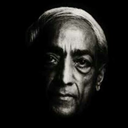
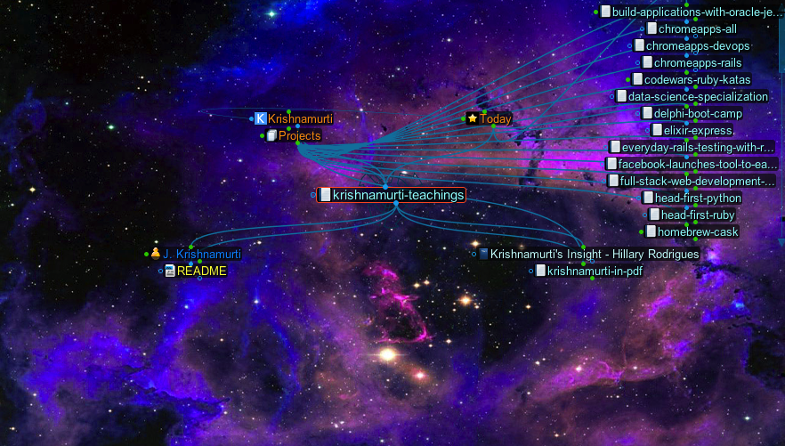

```
Roberto Nogueira  BSd EE, MSd CE
Solution Integrator Experienced - Certified by Ericsson
```
```
```

# Krishnamurti Teachings



**About**

This is intended to study the Krishnamurti Teachings in order to get the Visual Language to be described using `The Brain 9`.



**Table of Contents**

```
[x] ABSTRACT
[x] ACKNOWLEDGEMENTS
[x] INTRODUCTION
Chapter 1. BIOGRAPHY, MAJOR WORKS, AND INFLUENCE
[x] Early Childhood
[x] The Theosophical Society
[x] Some Pertinent Teachings of Theosophy
[x] Krishnamurti among the Theosophists
[x] Realization and Insight
[x] Post-Theosophical Years, Works, and Influence

Chapter 2. APPROACH AND OVERVIEW
[~] A: Significant Aspects of Krishnamurti's Approach
[ ] B: Overview of the Content in Krishnamurti's Approach
[x] Day One
[ ] Day Two
[ ] Day Three
[ ] Day Four
[ ] Day Five

Chapter 3. THE CONDITIONED MIND
[ ] What-is Thought and Knowledge

Chapter 4. INSIGHT
[ ] Indirect Perception
[ ] Observation, Attention, and Choiceless Awareness
[ ] Insight
[ ] Partial Insights
[ ] Total Insight into What-is

Chapter 5. THE RELIGIOUS MIND
[ ] Silence, Timeless Space, Emptiness and Energy
[ ] Understanding and Intelligence
[ ] Love, Death, Creation, and Compassion
[ ] Meditation and the Religious Life
[ ] Truth, God, Mind, and the Ground of Existence

Chapter 6. SUMMARY OF THE ANALYSIS.
[ ]

Chapter 7. GENERAL APPRAISAL OF KRISHNAMURTI'S APPROACH.
[ ] Existing Criticisms
[ ] Similarities to Other Religious Philosophies
[ ] Mysticism
[ ] Taoism
[ ] Sankara's Vedanta
[ ] Buddhism
[ ] Implications for the Field of Religious Studies
[ ] CONCLUSION
[ ] BIBLIOGRAPHY
```
